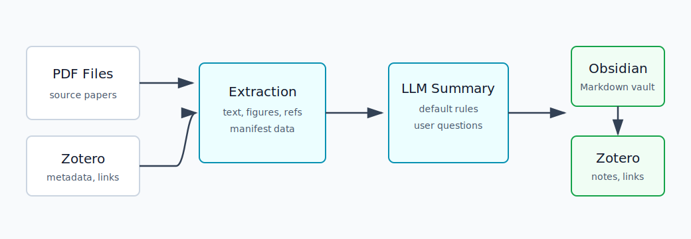
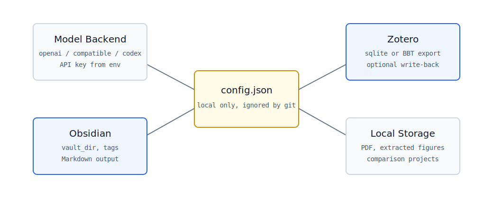
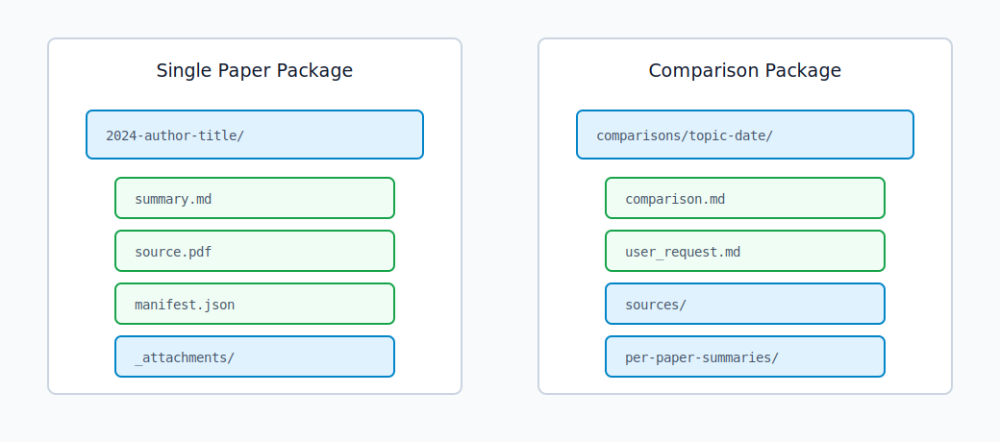
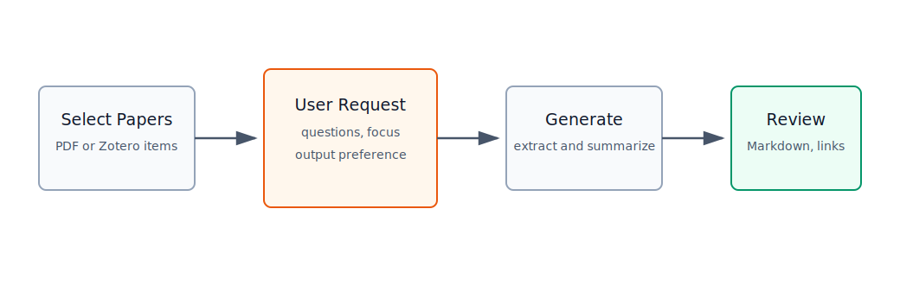

# paper-reading-workflow

## 最新更新（2026-04-26）

本次发布新增并改进了以下工作流能力：

- **精读 DOCX/PDF 包**：对已经生成 Markdown 总结的条目，可一键生成 `deep_reading_package/`，其中包含精读版 `.docx`、`.pdf` 和 `deep_reading_manifest.json`。
- **GUI 操作入口**：在 collection 页面新增 `Deep DOCX/PDF Package` 按钮；点击 `Generate / Attach Summary` 时，如果条目已有总结，会弹出三个选项：重新生成总结、生成精读 DOCX/PDF 包、AI 检查规范性。
- **总结完成后联动**：新总结生成完成后，GUI 会询问是否立即生成精读 DOCX/PDF 包。
- **Zotero 链接回写**：启用 `zotero_api` 且配置 `ZOTERO_API_KEY` 后，精读包中的 DOCX/PDF 会作为 Zotero linked-file 附件写回原条目，同时摘要 note 中包含精读包链接。
- **PDF 图表裁剪改进**：图表抽取不再只依赖图注上方固定裁剪，改为基于 PyMuPDF 的同栏图像/矢量对象候选框合并策略，减少截到正文、漏截边界和图像不完整的问题。
- **图片裁剪与引用检查**：新增 `check-summary` 子命令，优先用本地规则检查 Markdown 图片引用、缺失图片、疑似整页截图、过小碎片图和极端比例裁剪；只有发现可疑项时才调用 AI 做轻量复核，减少模型资源消耗。

相关命令：

```powershell
.\03-tools\pdf_tools\.venv\Scripts\python.exe .\05-zotero_obsidian_sync\sync_pipeline.py deep-package --pdf "D:/papers/example.pdf"
.\03-tools\pdf_tools\.venv\Scripts\python.exe .\05-zotero_obsidian_sync\sync_pipeline.py check-summary --pdf "D:/papers/example.pdf"
```

`paper-reading-workflow` 是一个面向学术文献阅读的本地自动化工作流，支持从 PDF 与 Zotero 元数据中提取信息，调用大语言模型生成单篇论文总结或多篇论文对比报告，并将结果组织为适合 Obsidian 长期维护的 Markdown 文档库。



## 功能概览

- **单篇论文总结**：提取 PDF 文本、元数据、图片清单和参考信息，按预设规范生成结构化 Markdown 总结。
- **多篇论文对比**：将多篇论文组织为独立对比项目，保留原文、单篇总结、对比材料和最终对比报告。
- **自定义总结要求**：生成前输入阅读目标、关键问题和输出偏好，并与默认总结规范合并后提交给模型。
- **Zotero 联动**：支持读取 Zotero 本地库或 Better BibTeX 导出数据，并可将 Markdown 总结回写到 Zotero 条目。
- **Obsidian 联动**：输出普通 Markdown 文件，保留双链、标签、附件目录和项目结构。
- **多模型后端**：支持 OpenAI、OpenAI-compatible API、Codex CLI，可配置 DeepSeek、通义千问、Kimi、GLM 等兼容服务。
- **本地优先**：PDF、个人配置、Zotero 数据库、Obsidian 文档库和模型密钥默认不进入版本控制。

## 目录结构

```text
paper-reading-workflow/
|-- 02-paper-library/                 # 本地 PDF 和文献材料，默认不纳入版本控制
|-- 03-tools/
|   `-- pdf_tools/
|       |-- extract_pdf.py            # PDF 文本、图片、公式等提取
|       `-- .venv/                    # 本地虚拟环境，默认不纳入版本控制
|-- 04-summary-rules/
|   |-- default.md                    # 单篇论文默认总结规范
|   `-- comparison_default.md         # 多篇论文对比总结规范
|-- 05-zotero_obsidian_sync/
|   |-- sync_pipeline.py              # 命令行主入口
|   |-- paper_sync_gui.py             # 图形界面入口
|   |-- package_summary.py            # 总结打包和回链
|   |-- config.example.json           # 配置模板
|   `-- config.json                   # 本地配置，默认不纳入版本控制
|-- docs/
|   |-- assets/                       # 文档示意图
|   `-- examples/                     # 示例文档
`-- setup_windows.ps1                 # Windows 初始化脚本
```



## 配置需求

### 基础环境

推荐环境如下：

- Windows 10/11
- PowerShell 5.1 或 PowerShell 7
- Python 3.11 或更新版本
- Git
- Zotero 7
- Obsidian 1.5 或更新版本

### 安装步骤

#### Step 1：安装基础软件

安装以下软件，并确认它们可以在 PowerShell 中被调用：

```powershell
git --version
python --version
```

如果 `python --version` 无法显示 Python 3.11 或更新版本，建议从 Python 官网安装，并在安装时勾选 `Add python.exe to PATH`。

#### Step 2：克隆仓库

选择一个本地代码目录，例如 `D:\github`：

```powershell
New-Item -ItemType Directory -Force D:\github
cd D:\github
git clone https://github.com/Wzyt09/paper-reading-workflow.git
cd paper-reading-workflow
```

如果已经下载了压缩包，也可以直接解压到 `D:\github\paper-reading-workflow`，再进入该目录。

#### Step 3：初始化 Python 环境

```powershell
cd D:\github\paper-reading-workflow
.\setup_windows.ps1
```

脚本会完成以下工作：

- 创建 `03-tools/pdf_tools/.venv` 虚拟环境。
- 安装 `requirements.txt` 中的 Python 依赖。
- 检查必要目录是否存在。

如需手动初始化，可执行：

```powershell
python -m venv .\03-tools\pdf_tools\.venv
.\03-tools\pdf_tools\.venv\Scripts\python.exe -m pip install --upgrade pip
.\03-tools\pdf_tools\.venv\Scripts\python.exe -m pip install -r .\requirements.txt
```

#### Step 4：创建本地配置文件

```powershell
Copy-Item .\05-zotero_obsidian_sync\config.example.json .\05-zotero_obsidian_sync\config.json
```

后续运行只需编辑 `05-zotero_obsidian_sync/config.json`。模型密钥建议通过环境变量提供，不应写入配置文件或提交到代码仓库。

#### Step 5：配置模型密钥

根据选择的模型服务商设置环境变量。例如使用 DeepSeek：

```powershell
[Environment]::SetEnvironmentVariable("DEEPSEEK_API_KEY", "<api-key>", "User")
```

关闭并重新打开 PowerShell 后，检查变量是否生效：

```powershell
Get-ChildItem Env:DEEPSEEK_API_KEY
```

随后在 `config.json` 中配置模型后端。DeepSeek 的完整示例见 [DeepSeek 配置示例](docs/examples/config.deepseek.example.json)。

#### Step 6：配置 Zotero 数据来源

二选一即可：

- **本地数据库模式**：填写 `zotero.db_path` 与 `zotero.storage_dir`，适合单机环境。
- **Better BibTeX 导出模式**：填写 `zotero.bbt_export_path`，适合跨设备和跨系统部署。

推荐优先使用 Better BibTeX 导出模式。详细说明见 [Zotero 配置](#zotero-配置)。

#### Step 7：配置 Obsidian 输出目录

在 `config.json` 中填写 Obsidian vault 路径：

```json
{
  "obsidian": {
    "vault_dir": "D:/Obsidian/PaperVault",
    "papers_subdir": "papers",
    "tags_subdir": "tags",
    "tag_prefix": "paper"
  }
}
```

如果还没有 Obsidian vault，可先在 Obsidian 中创建一个新 vault，再将 `vault_dir` 指向该目录。

#### Step 8：运行首次验证

检查命令行入口是否可用：

```powershell
.\03-tools\pdf_tools\.venv\Scripts\python.exe .\05-zotero_obsidian_sync\sync_pipeline.py --help
```

如需验证图形界面：

```powershell
.\03-tools\pdf_tools\.venv\Scripts\python.exe .\05-zotero_obsidian_sync\paper_sync_gui.py
```

如需用一个本地 PDF 测试单篇总结：

```powershell
.\03-tools\pdf_tools\.venv\Scripts\python.exe .\05-zotero_obsidian_sync\sync_pipeline.py summarize `
  --pdf "D:/paper-reading-data/pdfs/example.pdf" `
  --summary-backend openai_compatible
```

首次运行成功后，应能在配置的 Obsidian vault 或输出目录中看到 Markdown 总结、附件目录和 `manifest.json`。

### 大模型配置

项目支持三类总结后端：

- `openai`：OpenAI 官方 API。
- `openai_compatible`：兼容 OpenAI Chat Completions 或 Responses 风格的服务，适用于 DeepSeek、通义千问、Kimi、GLM 等服务商。
- `codex`：调用本机 Codex CLI。

DeepSeek 配置示例：

```json
{
  "summary_backend": "openai_compatible",
  "llm": {
    "provider": "deepseek",
    "base_url": "https://api.deepseek.com",
    "api_key_env": "DEEPSEEK_API_KEY",
    "model": "deepseek-chat",
    "temperature": 0.2
  }
}
```

通义千问 DashScope OpenAI-compatible 配置示例：

```json
{
  "summary_backend": "openai_compatible",
  "llm": {
    "provider": "dashscope",
    "base_url": "https://dashscope.aliyuncs.com/compatible-mode/v1",
    "api_key_env": "DASHSCOPE_API_KEY",
    "model": "qwen-plus",
    "temperature": 0.2
  }
}
```

Kimi 配置示例：

```json
{
  "summary_backend": "openai_compatible",
  "llm": {
    "provider": "moonshot",
    "base_url": "https://api.moonshot.cn/v1",
    "api_key_env": "MOONSHOT_API_KEY",
    "model": "moonshot-v1-32k",
    "temperature": 0.2
  }
}
```

## Zotero 配置



### 读取 Zotero 本地数据库

本地数据库模式适合单机环境。配置项示例：

```json
{
  "zotero": {
    "db_path": "C:/Users/<username>/Zotero/zotero.sqlite",
    "storage_dir": "C:/Users/<username>/Zotero/storage",
    "collection_name": "待读文章"
  }
}
```

使用本地数据库模式时，应注意以下事项：

- 批处理运行前关闭 Zotero，或确认 Zotero 未处于数据库写入状态。
- Windows 路径可使用 `/`，或使用转义后的 `\\`。
- 如果 Zotero library 位于 NAS 或同步盘，推荐在稳定的本地缓存路径上运行。

### 使用 Better BibTeX 导出

Better BibTeX 导出模式更适合跨设备和跨系统部署。

1. 在 Zotero 中安装 Better BibTeX 插件。
2. 右键目标 collection，选择导出。
3. 导出格式选择 Better BibTeX JSON。
4. 勾选 keep updated。
5. 将导出的 JSON 路径写入配置文件。

配置示例：

```json
{
  "zotero": {
    "bbt_export_path": "D:/paper-reading-data/zotero_export.json"
  }
}
```

如果项目版本提供 `setup-bbt` 子命令，可使用该命令辅助创建或检查 Better BibTeX 导出配置。

### 回写 Zotero

将 Markdown 总结附回 Zotero 条目时，需要配置 Zotero Web API：

```json
{
  "zotero_writeback": {
    "enabled": true,
    "user_id": "<zotero-user-id>",
    "library_type": "user",
    "api_key_env": "ZOTERO_API_KEY",
    "update_summary_note": true,
    "attach_summary_markdown": true,
    "summary_attachment_mode": "link"
  }
}
```

说明：

- Zotero API key 应通过环境变量提供。
- `summary_attachment_mode` 推荐使用 `link`，Zotero 中保存本地 Markdown 链接，避免生成重复副本。
- 使用 group library 时，`library_type` 设为 `group`，并填写对应 group id。

## Obsidian 配置

Obsidian 不需要额外插件即可读取项目输出。推荐配置：

```json
{
  "obsidian": {
    "vault_dir": "D:/Obsidian/PaperVault",
    "papers_subdir": "papers",
    "tags_subdir": "tags",
    "tag_prefix": "paper"
  }
}
```

输出结构示例：

```text
D:/Obsidian/PaperVault/
|-- papers/
|   |-- 2024-author-title/
|   |   |-- summary.md
|   |   |-- source.pdf
|   |   |-- manifest.json
|   |   `-- _attachments/
|   `-- comparisons/
|       `-- 2026-04-26-rydberg-crosstalk/
|           |-- comparison.md
|           |-- manifest.json
|           |-- sources/
|           `-- per-paper-summaries/
`-- tags/
```

Obsidian 中可使用以下能力：

- `[[summary]]` 跳转到单篇总结。
- `[[comparison]]` 跳转到对比总结。
- `#paper/quantum-computing` 等标签用于主题聚合。
- Dataview 插件可选，用于构建阅读进度、主题、年份、模型等索引。

## 使用方法

### 启动图形界面

```powershell
cd D:\github\paper-reading-workflow
.\03-tools\pdf_tools\.venv\Scripts\python.exe .\05-zotero_obsidian_sync\paper_sync_gui.py
```

图形界面流程：

1. 选择 Zotero collection 或本地 PDF 文件。
2. 选择单篇总结或多篇对比。
3. 在弹出的对话框中输入阅读目标、关键问题和格式偏好。
4. 运行总结任务。
5. 检查输出的 Markdown、附件和 Zotero/Obsidian 链接。



### 单篇总结

```powershell
.\03-tools\pdf_tools\.venv\Scripts\python.exe .\05-zotero_obsidian_sync\sync_pipeline.py summarize `
  --pdf "D:/paper-reading-data/pdfs/example.pdf" `
  --summary-backend openai_compatible
```

默认规范来自 `04-summary-rules/default.md`。运行时输入的额外要求会追加到默认规范后，例如：

```text
重点解释实验设计、主要假设、图 2 和图 4 的含义，并列出后续复现实验需要检查的参数。
```

### 多篇论文对比

```powershell
.\03-tools\pdf_tools\.venv\Scripts\python.exe .\05-zotero_obsidian_sync\sync_pipeline.py compare `
  --pdf "D:/papers/a.pdf" `
  --pdf "D:/papers/b.pdf" `
  --pdf "D:/papers/c.pdf" `
  --topic "Rydberg quantum computing crosstalk"
```

多篇对比默认规范来自 `04-summary-rules/comparison_default.md`。推荐的对比维度包括：

- **问题定义**：各文献解决的问题，以及问题之间的关系。
- **方法路线**：理论、实验、模拟、系统实现等技术路线。
- **关键结论**：核心结论、适用条件和证据强度。
- **图表证据**：关键图片、表格、公式及其支撑的论点。
- **差异矩阵**：研究对象、模型假设、实验设置、评价指标、局限性逐项对比。
- **综合判断**：相互支持的结论、存在冲突的结论和后续阅读建议。

### 打包已有总结

```powershell
.\03-tools\pdf_tools\.venv\Scripts\python.exe .\05-zotero_obsidian_sync\package_summary.py `
  --summary "D:/paper-reading-data/summaries/example.md" `
  --pdf "D:/paper-reading-data/pdfs/example.pdf"
```

打包流程会生成 `manifest.json`，记录原文、总结、附件、模型、时间和回链信息，便于后续迁移和审计。

## 示例

仓库提供以下示例材料，用于说明输出结构和配置方式：

- [单篇论文总结示例](docs/examples/single-paper-summary-demo.md)
- [多篇论文对比示例](docs/examples/multi-paper-comparison-demo.md)
- [DeepSeek 配置示例](docs/examples/config.deepseek.example.json)

单篇总结片段：

```text
一句话结论：
本文展示了一种在中性原子量子计算平台中降低串扰影响的实验策略，
核心价值在于把误差来源拆分为可测量、可校准、可比较的几个部分。

关键图片：
- 图 1：实验系统与原子阵列结构。
- 图 2：串扰随距离和脉冲参数变化的测量结果。
- 图 4：校准策略前后的保真度对比。
```

多篇对比片段：

```text
综合判断：
三篇文章都关注 Rydberg 阵列中的门操作误差，但侧重点不同：
A 更像误差表征框架，B 给出控制脉冲优化方案，C 讨论规模化系统中的工程约束。
如果目标是设计实验，优先读 A 和 B；如果目标是评估架构可扩展性，C 更关键。
```

## 生成结果示意

```text
comparison-project/
|-- comparison.md                     # 最终对比总结
|-- user_request.md                   # 当前任务输入的特定要求
|-- comparison_prompt.md              # 默认规范 + 任务要求
|-- manifest.json
|-- sources/
|   |-- paper-a.pdf
|   |-- paper-b.pdf
|   `-- paper-c.pdf
|-- extracted/
|   |-- paper-a/
|   |-- paper-b/
|   `-- paper-c/
`-- per-paper-summaries/
    |-- paper-a.summary.md
    |-- paper-b.summary.md
    `-- paper-c.summary.md
```

每个单篇总结可链接到所属对比项目：

```markdown
相关对比：[[2026-04-26-rydberg-crosstalk/comparison]]
```

对比总结可反向列出每篇论文：

```markdown
- [[paper-a.summary]]
- [[paper-b.summary]]
- [[paper-c.summary]]
```

## 数据边界

仓库默认排除以下本地数据：

- PDF 原文
- Zotero 数据库
- Obsidian vault
- `config.json`
- API key
- 生成的大批量总结缓存
- Python 虚拟环境

示例文档和说明图片位于 `docs/` 目录。说明图片为自绘 SVG，示例文档用于展示输出结构，不依赖个人文献库或第三方论文原图。

## 常见问题

### 找不到 Zotero 条目

确认 `collection_name` 是否与 Zotero 中的 collection 名称完全一致。使用 Better BibTeX 导出时，检查 JSON 文件是否已经自动更新。

### Obsidian 中链接打不开

检查 `vault_dir` 是否指向真实 vault 根目录，并确认 `papers_subdir` 未重复嵌套。

### 模型调用失败

重点检查以下配置：

- 环境变量是否生效：`Get-ChildItem Env:DEEPSEEK_API_KEY`
- `base_url` 是否包含正确的 `/v1` 或兼容路径。
- 模型名称是否为服务商当前支持的模型。

### 总结过长或不够聚焦

可在生成前的弹窗中明确阅读目标，例如：

```text
只关注方法和实验局限，不需要逐段翻译。请重点回答：
1. 文章的核心假设是什么？
2. 关键图表分别支撑了什么结论？
3. 复现实验最需要注意哪些参数？
```

### 是否为 Zotero 原生插件

当前版本是本地 Python 工具，不是 Zotero 原生插件。后续可拆分为以下架构：

- Zotero 插件负责选择条目、收集 PDF、展示任务状态。
- 本地 Python 服务负责 PDF 提取、模型调用、文档打包。
- Obsidian vault 作为最终 Markdown 知识库。

该架构可以保留现有本地工作流，同时逐步增加 Zotero 插件式交互。

## 许可证

本项目尚未声明开源许可证。正式分发前应补充明确许可证，例如 MIT、Apache-2.0 或 GPL-3.0。
